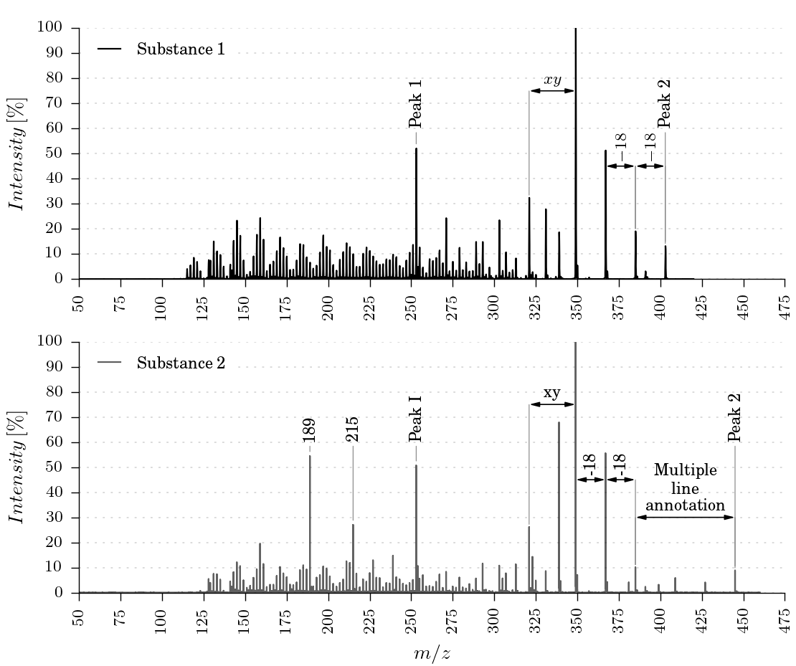

.. _Screenshots:

Examples
===========

Automatic peak's annotations
-----------------------------------------------------------------------------

.. image:: ../_static/images/ex1.png
    :alt: Example 1

Manually annotate peaks and distances between peaks
-----------------------------------------------------------------------------

.. image:: ../_static/images/ex2.png
    :alt: Example 2

Compare two mass spectra
-----------------------------------------------------------------------------

